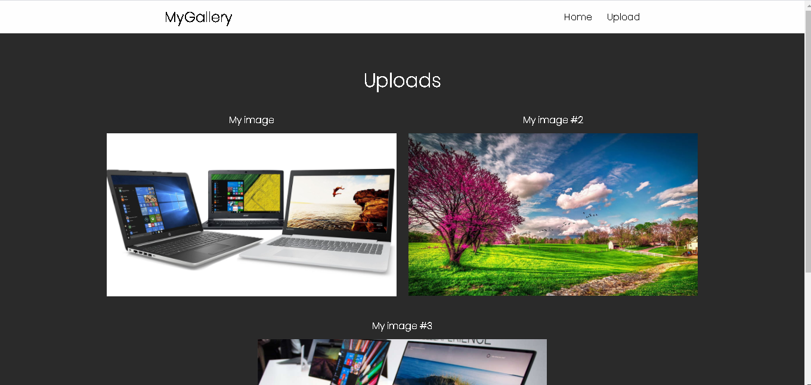
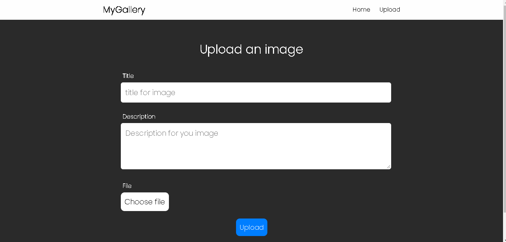

# My galley

*By Fernando BInternet*

### In this very small Proyect was used:
- [Express](https://expressjs.com/), the nodejs framewrok.
- [Multer](https://expressjs.com/en/resources/middleware/multer.html), for images uploads.
- [PugJS](https://pugjs.org/), for templates.

## Home page

## Public page

